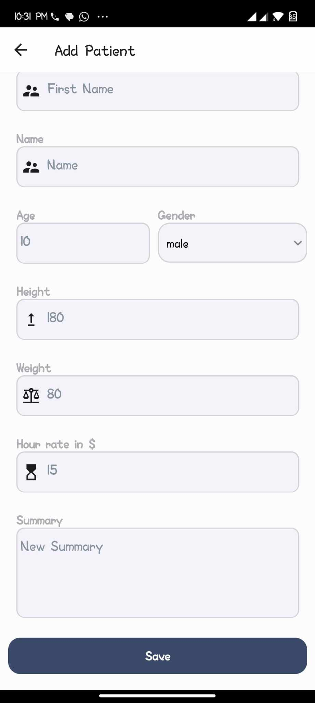
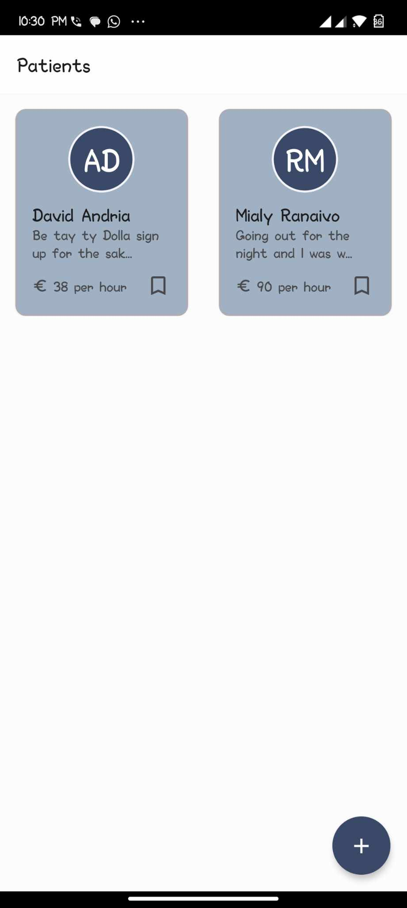
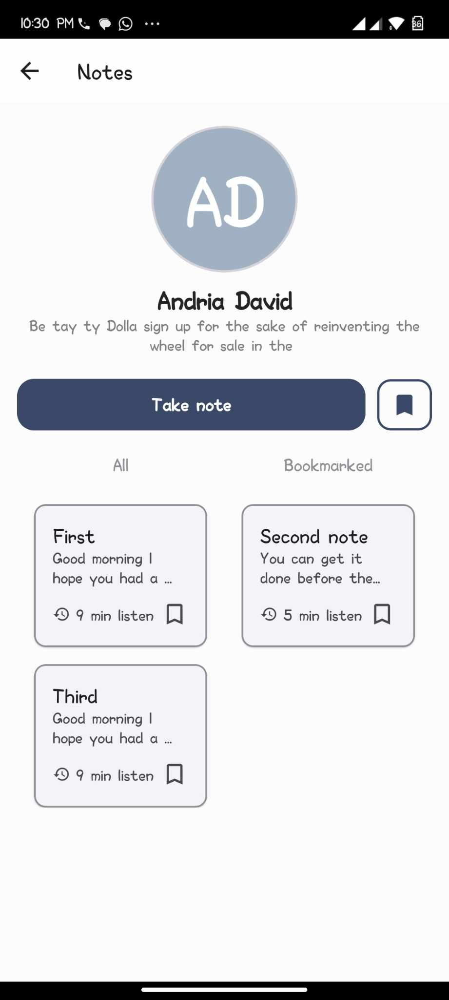
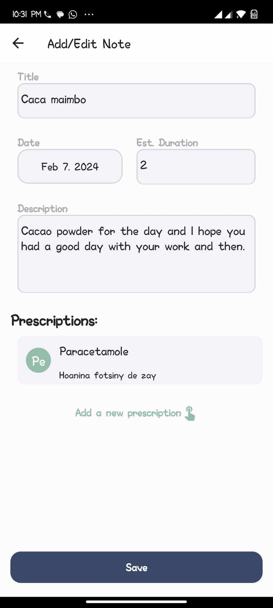

<a name="readme-top"></a>

<div align="center">
  <!-- You are encouraged to replace this logo with your own! Otherwise you can also remove it. -->
 
  <br/>

  <h3><b>Nutrimons</b></h3>

</div>

<!-- TABLE OF CONTENTS -->

# 📗 Table of Contents

- [📖 About the Project](#about-project)
  - [🛠 Built With](#built-with)
    - [Tech Stack](#tech-stack)
    - [Key Features](#key-features)
  - [🚀 Debug App](#live-demo)
- [💻 Getting Started](#getting-started)
  - [Setup](#setup)
  - [Prerequisites](#prerequisites)
  - [Install](#install)
  - [Usage](#usage)
  - [Deployment](#deployment)
- [👥 Authors](#authors)
- [🔭 Future Features](#future-features)
- [🤝 Contributing](#contributing)
- [⭐️ Show your support](#support)
- [🙏 Acknowledgements](#acknowledgements)
- [📝 License](#license)

<!-- PROJECT DESCRIPTION -->

# 📖 Nutrimons <a name="about-project"></a>

**Nutrimons** a platform for nutritionists to follow their patients.

## 🛠 Built With <a name="built-with"></a>

### Tech Stack <a name="tech-stack"></a>

<details>
  <summary>Client</summary>
  <ul>
    <li><a href="https://reactjs.org/">React.js</a></li>
  </ul>
</details>

<details>
  <summary>Mobile Framework</summary>
  <ul>
    <li><a href="https://reactnative.dev/">React Native</a></li>
  </ul>
</details>

<details>
<summary>Storage</summary>
  <ul>
    <li><a href="https://github.com/mrousavy/react-native-mmkv">MMKV</a></li>
  </ul>
</details>

<!-- Features -->

### Key Features <a name="key-features"></a>

- **users can create patients**
- **users can take notes about their consultations**
- **users can retrieve patient and notes about their consultations**

<p align="right">(<a href="#readme-top">back to top</a>)</p>

<!-- LIVE DEMO -->

## 🚀 Debug App <a name="live-demo"></a>

- [Download and install](https://github.com/andrianarivo/nutrimons/releases/tag/dev-0.0.1)

<div>
  
  
  
  
</div>

<p align="right">(<a href="#readme-top">back to top</a>)</p>

<!-- GETTING STARTED -->

## 💻 Getting Started <a name="getting-started"></a>

To get a local copy up and running, follow these steps.

### Prerequisites

In order to run this project you need:

- `VSCode`
- `Node.js`
- `Android Studio` and | or `XCode`
- `Simulator` and | or `Real Device`

### Setup

Clone this repository to your desired folder:

```sh
  cd my-folder
  git clone https://github.com/andrianarivo/nutrimons.git
```

### Install

Install this project with:

```sh
  cd my-project
  npm i
```

### Usage

To run the project, execute the following command:

```sh
  npm start
```

### Deployment

You can deploy this project using your own deployment solution

<p align="right">(<a href="#readme-top">back to top</a>)</p>

<!-- AUTHORS -->

## 👥 Authors <a name="authors"></a>

👤 **David**

- GitHub: [@andrianarivo](https://github.com/andrianarivo)
- Twitter: [@dandrianarivo](https://twitter.com/dandrianarivo)
- LinkedIn: [LinkedIn](https://linkedin.com/in/andrianarivo)

<p align="right">(<a href="#readme-top">back to top</a>)</p>

<!-- FUTURE FEATURES -->

## 🔭 Future Features <a name="future-features"></a>

- [ ] **Online Synchronisation**
- [ ] **Ability to update and remove Patients**
- [ ] **Import or take pictures of Patients**

<p align="right">(<a href="#readme-top">back to top</a>)</p>

<!-- CONTRIBUTING -->

## 🤝 Contributing <a name="contributing"></a>

Contributions, issues, and feature requests are welcome!

Feel free to check the [issues page](https://github.com/andrianarivo/nutrimons/issues).

<p align="right">(<a href="#readme-top">back to top</a>)</p>

<!-- SUPPORT -->

## ⭐️ Show your support <a name="support"></a>

If you like this project consider adding a ⭐

<p align="right">(<a href="#readme-top">back to top</a>)</p>

<!-- ACKNOWLEDGEMENTS -->

## 🙏 Acknowledgments <a name="acknowledgements"></a>

I would like to thank Yana Hrytsai from Behance for the design inspiration. Nothing has been changed from the original design. [link](https://www.behance.net/gallery/178837985/Learning-App-UXUI-Case-Study?fbclid=IwAR3NFWbu8En9fu2QPTeJ0q288bcpRAQXx9EKOJkx87J7qeT9zh5OFAc7wdQ&)

<p align="right">(<a href="#readme-top">back to top</a>)</p>

<!-- LICENSE -->

## 📝 License <a name="license"></a>

This project is [MIT](./LICENSE) licensed.

<p align="right">(<a href="#readme-top">back to top</a>)</p>

